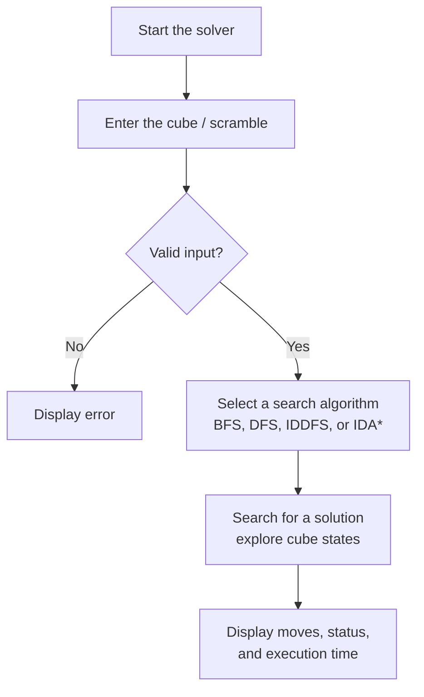

# Rubik's Cube Solver

A virtual 3×3 Rubik's Cube solver written in **C++**. It represents the cube using data structures, scrambles it, and solves it with four search algorithms: **BFS, DFS, IDDFS, and Korf's IDA\***. The project explores how algorithm choice affects solving time when the search space is huge.

## Table of Contents

- [Features](#features)
- [Performance](#performance)
- [Algorithms](#algorithms)
- [How It Works](#how-it-works)
- [Getting Started](#getting-started)
- [Usage](#usage)
- [Sample Output](#sample-output)
- [Move Notation](#move-notation)
- [Error Handling](#error-handling)
- [Project Structure](#project-structure)
- [Future Improvements](#future-improvements)

## Features

- Virtual 3×3 Rubik's Cube with move simulation
- Three distinct cube models implemented with C++ data structures
- Scrambling by applying a sequence of moves
- Four search algorithms: BFS, DFS, IDDFS, and Korf's IDA\*
- Input validation and handling of critical edge cases
- Command-line interface for choosing an algorithm and entering a scramble

## Performance

| Algorithms | Scramble depth | Solving time |
| --- | --- | --- |
| BFS, DFS, IDDFS | Up to 8 moves | Under 3 seconds |
| Korf's IDA\* | Up to 13 moves | Under 10 seconds |

> Timings depend on hardware, the specific scramble, compiler settings, and search parameters. Add your test machine and compiler details here for reproducibility.

## Algorithms

| Algorithm | Main idea | Key feature |
| --- | --- | --- |
| **BFS** | Explores states level by level | Queue; finds a shortest solution (all moves cost the same) |
| **DFS** | Explores one path deeply, then backtracks | Stack / recursion; low memory |
| **IDDFS** | Repeats DFS with increasing depth limits | Combines DFS memory use with shallowest-solution search |
| **IDA\*** | Depth-first search guided by a heuristic | Cost threshold with `f(n) = g(n) + h(n)` |

In IDA\*, `g(n)` is the number of moves made so far and `h(n)` is a heuristic estimate of the moves remaining. BFS, DFS, and IDDFS are uninformed; IDA\* uses the heuristic to focus on promising states, which lets it handle deeper scrambles.

> Describe the heuristic you implemented (for example, a pattern database or a sum of piece distances) here.

## How It Works



1. The cube state is encoded in a data structure and updated after every move.
2. Each of the possible moves leads to a new state, forming a search tree.
3. The selected algorithm explores this tree until it reaches the solved state.
4. The solution is printed as a sequence of moves.

## Getting Started

### Prerequisites

- A C++ compiler with C++11 or later support (g++, clang++, or MSVC)

### Build

```bash
git clone <your-repo-url>
cd rubiks-cube-solver

g++ -O2 -std=c++17 -o solver *.cpp
```

> Adjust the file names and compiler flags to match your repository (or use your Makefile / CMake setup).

### Run

```bash
./solver
```

## Usage

1. Run the program.
2. Choose a search algorithm (1–4).
3. Enter a scramble as a sequence of moves.
4. The solver prints the solution and the number of moves.

## Sample Output

```
Welcome to Rubik's Cube Solver

Select algorithm:
1. BFS
2. DFS
3. IDDFS
4. IDA*

Enter choice: 4

Enter scramble: R U R' U'

Solving cube...

Solution found!
Solution: U R U' R'
Number of moves: 4
```

## Move Notation

Moves use standard cube notation:

| Move | Meaning |
| --- | --- |
| `U`, `D`, `L`, `R`, `F`, `B` | Turn the Up, Down, Left, Right, Front, or Back face 90° clockwise |
| `'` (e.g. `R'`) | Counter-clockwise turn |
| `2` (e.g. `R2`) | 180° turn |

> Remove or adjust any notation your solver does not support (for example, half-turns).

## Error Handling

The solver validates input and handles edge cases to avoid unexpected behavior, including:

- Invalid or unrecognized moves
- Invalid algorithm choices
- An already-solved cube
- Searches that reach their depth or cost limit without finding a solution

## Project Structure

```
rubiks-cube-solver/
├── main.cpp          # CLI and program flow
├── cube/             # cube models and move logic
├── search/           # BFS, DFS, IDDFS, IDA*
└── README.md
```

> Update this to match your actual files.

## Future Improvements

- Stronger heuristics (such as pattern databases) to solve deeper scrambles
- Additional pruning to avoid redundant moves and repeated states
- Support for reading a cube state directly from face colors
- A graphical interface to visualize the cube and its solution
- Benchmarks comparing all algorithms across scramble depths

## Why There Is No Live Demo

This is a local C++ algorithm project rather than a web application, so it is run from the command line. The source code in this repository can be compiled and executed directly.

## License

Add your license here (for example, MIT).
